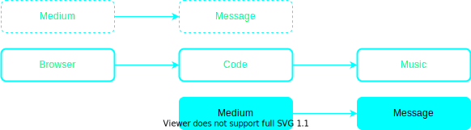

---
revealOptions:
    transition: 'fade'
    transitionSpeed: 'fast'
    highlight-theme: agate
---

The Browser, Genrative Music & A Bit Of Perspective

---

Laurens Inauen

Artist & Developer

Bern, Switzerland

----

- BA Music and Media Arts *2018*
- MA Contemporary Arts Practice *2020*
- BSc Computer Science *currently*

----

**generative music**

Note: I make generative music. I have started out with Max/MSP and worked with it for years but at some point I wanted to go deeper and use different environments and languages. In this workshop I will try to give you some background on why I think the browser is an important enivornment for art and how it fits into a broader context of media theory and art history in some sense. 

----

<!-- .slide: data-background="./assets/live-eternal.png" style="background-color:black" -->

## Live Eternal

**Generative Black Metal in the Web Browser**

Note: Maybe some of you have already seen this, its in Brandons spreadsheet. This is my master thesis project live eternal, a generative black metal piece in the browser.  I will sometimes reference this project and how I incorporated some of these thoughts into my art.
In the second half we will look at some code examples on how we can use certain programming concepts or patterns as means of composition. So, lets hit the ground running!

---

<!-- .slide: data-background="./assets/marshall-mcluhan.jpg" style="background-color: black !important;" -->

## Part I
**MEDIUM - MESSAGE**

----

>The medium is the message.

Marshall McLuhan, 1964

Note: This is probably the most infamous quote of modern media theory. It sums up quite well what media theory is all about. McLuhan doesn't mean that the medium is the whole message, but I let McLuhan explain it himself:

----

<iframe style="width:80vw; height:80vh" src="https://www.youtube.com/embed/UoCrx0scCkM?start=151" title="YouTube video player" frameborder="0" allow="accelerometer; autoplay; clipboard-write; encrypted-media; gyroscope; picture-in-picture" allowfullscreen></iframe>

Note: Go to 7:56 for question about question content doesn't matter

----

The medium **shapes** the message.

Note: So what McLuhan essentially means is that the medium shapes the message and has influence beyond the content of the message. If we believe this to be true then we have to draw two conclusions about that as artists.

----

1. The medium through which we express our art matters.

Note: I think we can all agree with that, a simple example a vinyl record is different from a digital streams because the medium not only leaves traces through its material but also the medium allows to be consumed in different ways. A vinyl record often listened to linearly and at length, a digital stream gives the listener more control, so he might skip tracks or listen to them in a different order. A vinyl you listen at home, a digital stream you might listen on the train.

----

2. If certain media allows us to express things that others don’t, then we can also create new forms of art through new media/technologies.

Note: This is quite obvious of course, electronic music can only exist because we have devices capable of producing electronic sounds. But what it means for us that maybe the browser as a technology offers us a way to create new music. What might be not obvious is what makes the browser as a medium so special and what exactly does it offer? 

----

Lets look at some **media art**.

----

<!-- .slide: data-background="./assets/nam-june-paik-tape.jpeg" style="background-color: black !important;" -->

**Random Access Music**

Note: Paik looks at what it really is that makes tape produce sound. Its a playback head moving over a magnetic tape, the fact that we use to go in just one direction at one specific speed is just a convention. We can do it, and it offers a lot, but  we can also choose not do it and instead explore all possibilities of the medium. If we want to look at how the browser makes sound, we should look at its medium-message relationship first.

----

Note: We can see here three layers: the browser, which is an environment to execute code, which is what produces sound. What this means is that our sound will always be a direct consequence of code, which is why I will talk primarily about this relationship today. Not because the browser is not interesting, but because the layers that the browser adds to our artwork are of political or social nature, not directly compositional, and we need this compositional foundation of what it means to express art through code.

----

What separates **code** from any other medium?

----

The possibility to **generate** art.

Note: This is not unique for the browser, code doesn't need to run in the browser! However we will see why the browser still plays an important role for art in general. In addition, the browser runs on javascript and that in terms will influence how we write code!

---

<!-- .slide: data-background="./assets/benjamin.jpg" style="background-color: black;" -->

## Part II
**A NEW AGE**

----

**The Work of Art in the Age of Mechanical Reproduction**

Note: To understand the importance of the browser as a medium for generative music, we will look at another great shift in history, where technology changed the way we were able to produce art. In the famous essay "The Work Of Art In The Age ...", Walter Benjamin talks about the transformation that art undergoes as it enters this new paradigm of mechanical reproduction.

----

>Even the most perfect reproduction of a work of art is lacking in one element: its presence in time and space, its unique existence at the place where it happens to be. This unique existence of the work of art determined the history to which it was subject throughout the time of its existence.

----

>[…] One might subsume the eliminated element in the term “aura” and go on to say: that which withers in the age of mechanical reproduction is the aura of the work of art.

Walter Benjamin, 1935

Note: So in this new age art looses its aura.

----

<!-- .slide: data-background="./assets/mona-lisa.jpg" style="background-color: black;" -->

**AUTHENTICITY + DISTANCE = AUTHORITY**

Note: But Benjamin is by no means mourning the loss of the aura. The aura is an expression of distance, authority and authenticity of an artwork. In the age of manual reproduction, the reproduction is essentially a forgery and has no authenticity, because authenticity is outside of the sphere of manual or technical reproduction. Distance is a result of the unique existence in time and space of the traditional art work and expresses itself in both of these dimensions. The artwork is fixed in space, and you have to go there and "meet" it, this establishes a form of hierarchy. But not only that, think about a traditional artwork in a museum: There is always a distance between the visitors on one side and the artwork on the other side. The mechanically reproduced artwork on the other hand "meets the beholder half way". The traditional art work is also determined by the history to which it is a subject in the time of its existence. This creates a kind of temporal distance between the art and its beholder.

----

<!-- .slide: data-background="./assets/camera.jpg" style="background-color: black;" -->

**MASS CULTURE**

Note: Through reproduction art looses this authenticity, distance and authority and for the first time in history mass culture becomes possible. This is important for Benjamin from a Marxist point of view:

----

> When Marx undertook his critique of the capitalistic mode of production ... [he] showed what could be expected of capitalism in the future. The result was that one could expect it not only to exploit the proletariat with increasing intensity, but ultimately to create conditions which would make it possible to abolish capitalism itself.

Note: So this process for Benjamin is of huge societal importance in the sense that it is part of a process in which capitalism destroys itself. And of course mass culture becoming available through capitalistic means of production, has had an enormous influence on the way we not only consume but make art.

----

**Why are we talking about this?**

Note: Some of you might ask yourself that. If think we are now in another change of paradigm and it can be helpful to look at history to draw our own conclusions for the present.

----

**The Work Of Art In The Age Of Digital Generation**

Note: I would argue that we are in the age of - not only the digital reproduction - but the digital generation of art, and while of course, digital reproduction was an important and interesting step, we now reach an age that is conceptually different than anything we had until now. There is a fundamental difference between reproduction and generation.

----

How do we conceptualize **generative art**?

Note: For me it's the idea of an abstract piece of art which exists only through its specific instantiation, which is unique in time and space - to use Benjamins terminology. These ideas aren't really new though, they have existed in art for quite some time. Not in the dodecaphonic music of Schönberg and his followers, not in the serialism of Messiaen or the algorithmic composition of Hiller & Issacson. We find it first in early performance art, for example the sound-walks of Max Neuhaus: The composition exists in the form of a route which the composer knows and walks with his audience. Within that route the sounds are certainly predictable, but ultimately - from a compositional perspective - random. It is interesting to note that reproduction - for the sake of e.g. documentation - is a big topic in performance art. Some argue that performance art could only be "reproduced" in a way that it loses its uniqueness. By means of preservation - a recording, a film - or by means of reenactment - essentially theater - by both of which it is no longer performance art as a result.

----

Why draw the line here and now?

Note: So if these ideas have existed that long even before real-time computer-generated music was a thing - which of course it has been for quite a while now - why do I draw the line here and now? Generative music - up until now - exists almost exclusively in an exhibition space. This usually means I have the go to the museum, sit on an uncomfortable chair or bench and listen to the generative piece for about 10 minutes with people walking in and out only conceptually being able to grasp the extent of the composition, then going home, mostly disappointed (this is essentially how Benjamin described *traditional* art in 1935). What good is an *endless* composition if I can only listen to it one time? This bothered me so much - that there was no generative music that I could listen to in the way I like to enjoy music - that I made live-eternal. Maybe now you start to see where this is going:

----

<!-- .slide: data-background="./assets/smartphones.jpg" style="background-color: black;" -->

>For the first time ever, the devices people use to listen to music are also capable of executing Generative Music systems.

Alex Bainter

Note: This quote by artist and developer (behind generative.fm) Alex Bainter explains what has changed: for the first time generative art has the possibility move into mass culture. It has that possibility because we don't just have the devices but with the modern browser, we now have an environment which allows artists to produce and distribute (important) real-time generative systems quite easily. I say quite easily in contrast to what we would need to do if we didn't have a modern browser.

----

**authenticity? distance? authority?**

Note: We might ask yourself how does this affect those three concepts which Benjamin introduces? I cannot give the answers to that but I can give some insight into what it means in my work.

----

<!-- .slide: data-background="./assets/black-metal.jpg" style="background-color: black;" -->

**black metal & authenticity**

<audio
    controls controlsList="nodownload"
    src="./assets/darkthrone.mp3">
        Your browser does not support the
        <code>audio</code> element.
</audio>

Note: Black metal is essentially a quest to bring authenticity to the reproducible medium. It does so by means of production: Because of our common understanding of the medium they use (e.g. tape, in the early days) we intuitively know that the recording “has not been tampered with” - meaning what we hear is in fact a physical effort and not some kind of technological trickery. Why is this necessary though? Performance art faces similar issues but often just refrains from reproduction? The answer is twofold. First, from a pragmatic point of view, musicians expressed themselves through the only medium they thought was available to them. Second, black metal is characterized by a misanthropic worldview, an antisocial attitude and individualism above all else (although rather superficial), ideas which do not fit well into the - by nature - social context of a concert/performance. Given the fact that many bands refrain from playing live shows, the authenticity which they can achieve within reproducible media seems - at least to their perception - to be a meaningful one. Black metal is also very anti-technological because from their perspective modern technology is what diminishes authenticity (sounds familiar?). Within the framework of black metal this is certainly true to some extent: By using triggered drum sets and modern production or editing technology the physical effort is no longer present as part of our shared understanding of the medium, but vanishes because of exactly that. This is where generative music comes into play, because our shared understanding of (digital) generative music is not one that is concerned with technological trickery as a substitute for physical effort. There is no physical effort involved which could be harmed in its authenticity by technological forces, authenticity is outside the sphere of digital generation (sounds familiar again?). We can see how our perception of authenticity shifted and how those same questions arise again. 

---

## Part III
**Generative Music & Authority**

Note: But what about the authority of the generative artwork? For this I will introduce a new line of thinking:

----

> To write a poem after Ausschwitz is barbaric.

Theodor W. Adorno, 1949

Note: This is a very strong quote that has been discussed extensively, applied to music, misinterpreted and ultimately even kind of retracted by Adorno. We are not going to discuss whether Adorno or not. I bring this up because I think it is almost impossible to talk about western - or more specifically european - modern art without the context of the second world war. I want to clarify that this is a very eurocentric view that I'm discussing here and I don't want to give anyone the feeling that we can only look at art through this specific lense, its just where I see **myself** as an artist and how I have been educated. What this quote essentially expresses is a feeling of distrust in art. The term art interpreted as the romantic artwork with all its pathos and overwhelmingness, which has been abused by the nazis for propaganda and manipulation.

----

**art / power**

Note: If we agree that art can be used to manipulate emotions - this is done all the time, commercials, movies, etc. - and we have seen where it can lead to - for example fascism, then we have a serious problem as artists. Power in terms creates **authority**. If we as artists have power over the listeners emotions -  this power can be abused by ourselves or others, like the nazis used Beethoven. Another aspect of this was the question of whether or not art is capable of expressing adequately the horrors of the second world war, if art is able to express genuine emotion at all? This has led to more and more abstract art in the post war era, which was a means for artists to cede some of this power and authority. And this could be it, art has to be abstract, there is no going back. Enter Pierre Schaffer:

----

>You have to remind musicians of what Dante wrote over the Gates of Hell: Abandon hope all ye who enter here. If you enter, if you want to make music, you must abandon hope. There's no way out of traditional music. 

----

>Seeing that no one knew what to do anymore with DoReMi, maybe we had to look outside that. Unfortunately it took me forty years to conclude that nothing is possible outside DoReMi. In other words, I wasted my life.

Pierre Schaeffer

Note: This is of course a statement of opinion - but its an opinion that I can intuitively sympathize with. You don't have to agree with Schaeffer here, but it struck a nerve with me and to be honest I can't fully express why. Maybe because I have been to conditioned to like traditional music? Maybe it is exciting to explore hierarchy, harmony, tonality and modality in music? Maybe refraining from doing so is like speaking a language that no one else speaks. I honestly can't give you an answer, but you can see the fundamental dilemma if you were to accept both of these thoughts - Adornos and Schaeffers. The only way out of this dilemma I found as an artist is generative music. With generative music I can move in and out of *DoReMi* as a merely incidental side effect, I can abstract the patterns behind manipulative music and reveal them as the result of a simple set of rules and not profound, overwhelming, human emotion. Generative music can be a way to give up power and authority. And to come back to why you are reading this, the browser can also play a role in this...

---

**open**

Note: The browser is by design a very open environment. JavaScript is a just-in-time compiled scripting language, which means that essentially because I receive the script and not some obscure binary that just does something on my device. (There is obscured JavaScript but I will not get into that). This means that we no longer - as is the case in almost all other settings for generative music - need to trust the composer. Because even in the museum setting the composer has total authority - is what I'm hearing really generative music? This comes down to an element of trust that we need to have in the composer, because authority without trust is oppression - in my view. In the browser this kind of black box of the generative system is revealed and even if the code is unreadable or if I can't read code, I at least know that the code is executed on my device, in real time. (This might seem silly but for me this is actually conceptually important). Some of you might noticed that I wrote open, not open source, this is because we should not use open source.

----

**free software <3**

Note: We should use free software. Because while the two terms almost describe the same thing in terms of code - most open source code is free software - there is a huge conceptual difference. While open source focuses only on practical aspects and is essentially a capitalistic appropriation of the free software movement, the latter takes an ethical stance about the way we should write and use software.

----

- The freedom to run the program as you wish, for any purpose (freedom 0).
- The freedom to study how the program works, and change it so it does your computing as you wish (freedom 1).Access to the source code is a precondition for this.
- The freedom to redistribute copies so you can help others (freedom 2).
- The freedom to distribute copies of your modified versions to others (freedom 3). By doing this you can give the whole community a chance to benefit from your changes. Access to the source code is a precondition for this.

----

>We campaign for these freedoms because everyone deserves them. With these freedoms, the users (both individually and collectively) control the program and what it does for them. 

----

>When users don’t control the program, we call it a “nonfree” or “proprietary” program. The nonfree program controls the users, and the developer controls the program; this makes the program an instrument of **unjust power**.

GNU Foundation

Note: the programmer has power over the user, this power is abused so we should reject it. Sounds familiar right? 

----

free your code by using a free software license!

Note: I'm done here, lets go look at some code :)

----

